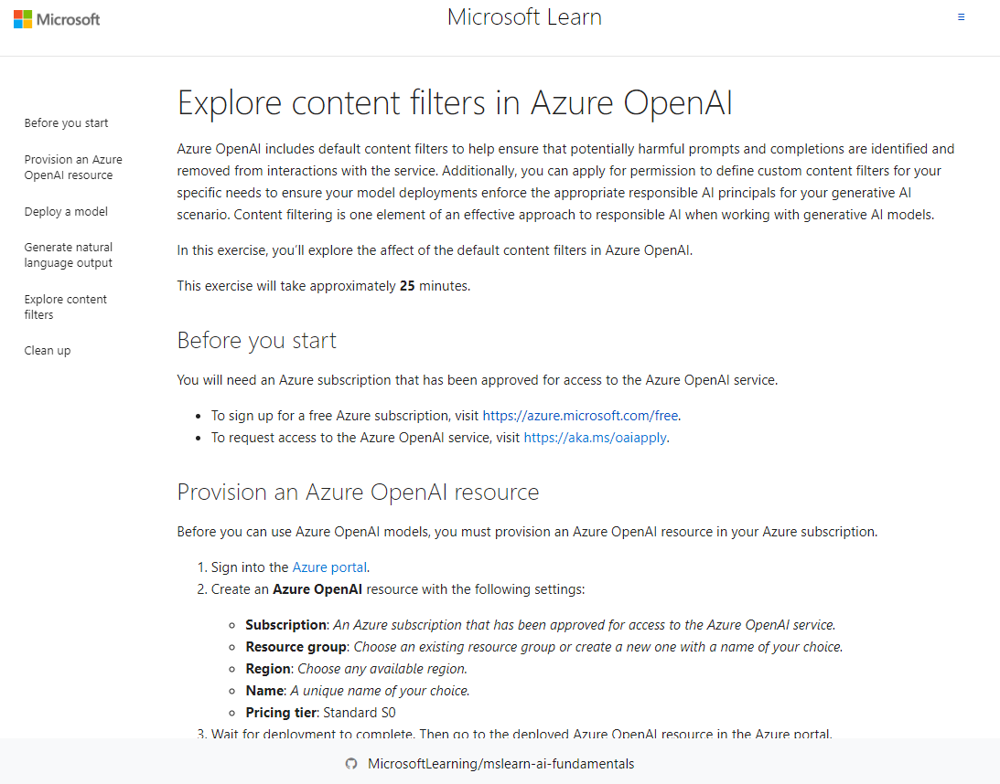

# Automated Machine Learning in Microsoft Copilot Recognizing Text from Images

Este repositório foi criado para apresentar minha experiência com a ferramenta de Aprendizado de Máquina do Microsoft Copilot (pelo fato de que a minha assinatura não permite utilizar a ferramenta Azure OpenAI) reconhecendo textos e também explicando sentimentos e fazendo analises textuais complexas dando apoio para fazer uma compreensão textual mais completa, a qual foi aprendida durante o bootcamp da DIO seguindo o(s) seguinte(s) [tutorial 1](https://microsoftlearning.github.io/mslearn-ai-fundamentals/Instructions/Labs/12-generative-ai.html#sign-into-microsoft-copilot), [tutorial 2](https://microsoftlearning.github.io/mslearn-ai-fundamentals/Instructions/Labs/13-azure-openai.html), [tutorial 3](https://microsoftlearning.github.io/mslearn-ai-fundamentals/Instructions/Labs/14-azure-openai-content-filters.html) do site da Microsoft Copilot, Azure OpenAI e os filtros dela para empregar uma das ferramentas de Inteligência Artificial disponibilizadas pela Azure. Isso permite explorar diferentes algoritmos e parâmetros para reconhecimento e facilita até a leitura, no Azure OpenAI, ele utiliza de ferramentas mais completas para transcrever o sentimento humano expresso em textos e assim fazendo o que a própria ferramenta lhe dê novas visões e perspectivas do meu texto.

## Insight do Microsoft Copilot

O Copilot oferece uma abordagem inovadora, gerando respostas com base em conversas anteriores.A capacidade de geração de imagens e código amplia o escopo de aplicação, mostrando versatilidade. É crucial entender as limitações de "memória" do chat para obter respostas relevantes. A tarefa bônus permitiu uma reflexão mais profunda sobre as aplicações práticas da IA generativa. Este exercício evidenciou como o Microsoft Copilot, ao combinar processamento de linguagem natural e geração criativa, abre possibilidades emocionantes para pesquisa, criação de conteúdo e resolução de problemas de forma eficiente.

## Print Microsoft Copilot

## Insight Azure OpenAI

O Azure OpenAI Service oferece uma integração fácil e eficiente para modelos generativos. O playground do Chat permite uma interação intuitiva com modelos de linguagem, mantendo o contexto da conversa. O suporte ao modelo DALL-E para geração de imagens é uma adição poderosa, abrindo possibilidades criativas. Este exercício destacou a versatilidade e a facilidade de uso do Azure OpenAI Service, proporcionando uma experiência envolvente na experimentação com modelos generativos para texto e imagem.

## Print Azure OpenAI

## Insight Explore Azure OpenAI

Os filtros de conteúdo padrão são fundamentais para evitar a geração de linguagem potencialmente prejudicial ou ofensiva. A configuração dos filtros permite ajustes em diferentes níveis de gravidade para categorias específicas, como ódio, sexualidade, violência e automutilação. A responsabilidade e a IA ética são priorizadas através da aplicação rigorosa desses filtros. Este exercício destacou a importância dos filtros de conteúdo na criação de modelos de IA generativos responsáveis e éticos, promovendo uma interação segura e positiva com a tecnologia.

## Print Filtros

## Possibilidades Durante o Conteúdo

Ao me aventurar nas tecnologias de IA, tive a oportunidade de explorar fascinantes ferramentas como o Microsoft Copilot e o Azure OpenAI. Com o Copilot, descobri a magia da IA generativa, permitindo-me gerar respostas contextuais e refiná-las ao longo de uma conversa. Desde perguntas sobre viagens até a criação de imagens e códigos, a versatilidade do Copilot é notável.

No Azure OpenAI, mergulhei na implantação e experimentação de modelos generativos, como o GPT-3.5 Turbo. O Azure OpenAI Studio ofereceu um ambiente poderoso para explorar, gerenciar e interagir com modelos, seja na geração de linguagem natural ou na criação de imagens impressionantes com o DALL-E.

Além disso, ao abordar a responsabilidade ética da IA, aprendi sobre os filtros de conteúdo no Azure OpenAI. A capacidade de personalizar esses filtros para atender às necessidades específicas do cenário é crucial. Desde categorias como Ódio e Violência até diferentes níveis de gravidade, percebi a importância de equilibrar segurança e flexibilidade na geração de conteúdo.

Essas experiências ampliaram meu entendimento das possibilidades e desafios associados à IA generativa. Desde interações cotidianas até aplicações mais complexas, a tecnologia está moldando um futuro onde a criatividade e a responsabilidade caminham lado a lado.

## Requisitos

- Criar uma conta grátis no Microsoft Azure e seguir o passo a passo.
